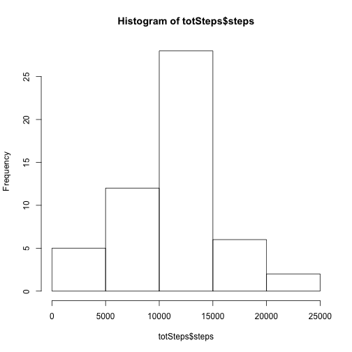
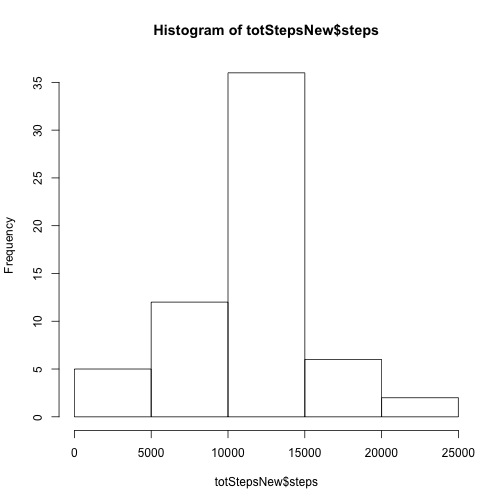
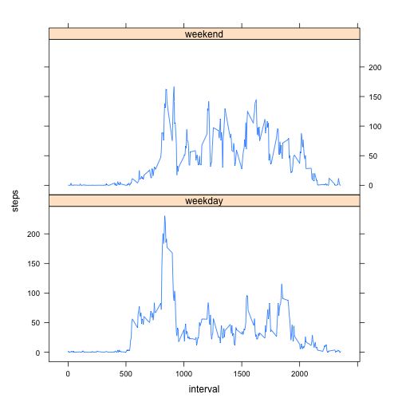

RepData Peer Assesssment 1
========================================================

## Loading and preprocessing the data
* Load the Data

```r
activityData=read.csv("activity.csv")
```
* Process/transform the data suitable for analysis

```r
totSteps<-aggregate(steps~date,data=activityData,sum,na.rm=TRUE)
```


## What is mean total number of steps taken per day?
* Make a histogram of the total number of steps taken each day

```r
hist(totSteps$steps)
```




* Calculate and report the **mean** and **median** total number of steps taken 
per day 


```r
mean(totSteps$steps)
```

```
## [1] 10766.19
```

```r
median(totSteps$steps)
```

```
## [1] 10765
```
* The **mean** total number of steps taken per day is 
    1.0766189 &times; 10<sup>4</sup> steps.
* The **median** total number of steps taken per day is 
    10765 steps.


## What is the average daily activity pattern?
* Make a time series plot (i.e. type = "l") of the 5-minute interval (x-axis) and the average number of steps taken, averaged across all days (y-axis)


```r
stepsInt<-aggregate(steps~interval,data=activityData,mean,na.rm=TRUE)
plot(steps~interval,data=stepsInt,type="l")
```


* Which 5-minute interval, on average across all the days in the dataset, contains the maximum number of steps? 

```r
stepsInt[which.max(stepsInt$steps),]$interval
```

```
## [1] 835
```

It is the **835th** interval.


## Imputing missing values
* Calculate and report the total number of missing values in the dataset (i.e. the total number of rows with NAs)

```r
sum(is.na(activityData$steps))
```

```
## [1] 2304
```
Total 2304 rows are missing.

* Devise a strategy for filling in all of the missing values in the dataset. The strategy does not need to be sophisticated. For example, you could use the mean/median for that day, or the mean for that 5-minute interval, etc.

: My solution was to create a function **"interval_steps"** to grab the mean steps for 5-minute intervals. 

```r
interval_steps<-function(interval){
    stepsInt[stepsInt$interval==interval,]$steps
}
```

* Create a new dataset that is equal to the original dataset but with the missing data filled in.


```r
activityImputed<-activityData   # Copy dataset into new dataset
count=0           #call the interval_steps funciton to fill in imputations
for(i in 1:nrow(activityImputed)){
    if(is.na(activityImputed[i,]$steps)){
        activityImputed[i,]$steps<-interval_steps(activityImputed[i,]$interval)
        count=count+1
    }
}
cat("Total ",count, "NA values were filled.\n\r")  
```

```
## Total  2304 NA values were filled.
## 
```

* Make a histogram of the total number of steps taken each day and Calculate and report the mean and median total number of steps taken per day. 

```r
totStepsNew<-aggregate(steps~date,data=activityImputed,sum)
hist(totStepsNew$steps)
```



```r
mean(totStepsNew$steps)
```

```
## [1] 10766.19
```

```r
median(totStepsNew$steps)
```

```
## [1] 10766.19
```


* The mean total number of steps taken per day is 
1.0766189 &times; 10<sup>4</sup> steps.
* The median total number of steps taken per day is 
1.0766189 &times; 10<sup>4</sup> steps.

* Do these values differ from the estimates from the first part of the assignment? What is the impact of imputing missing data on the estimates of the total daily number of steps?

: The mean value is the **SAME** because of the imputation, however the median value shows **SLIGHT** do to where the missing values were imputed.


## Are there differences in activity patterns between weekdays and weekends?
* Create a new factor variable in the dataset with two levels – “weekday” and “weekend” indicating whether a given date is a weekday or weekend day.

```r
activityImputed$day=ifelse(as.POSIXlt(as.Date(activityImputed$date))$wday%%6==0,
                          "weekend","weekday")
# For Sunday and Saturday : weekend, Other days : weekday 
activityImputed$day=factor(activityImputed$day,levels=c("weekday","weekend"))
```


* Make a panel plot containing a time series plot (i.e. type = "l") of the 5-minute interval (x-axis) and the average number of steps taken, averaged across all weekday days or weekend days (y-axis). The plot should look something like the following, which was creating using simulated data:

```r
stepsIntervalNew=aggregate(steps~interval+day,activityImputed,mean)
library(lattice)
xyplot(steps~interval|factor(day),data=stepsIntervalNew,aspect=1/2,type="l")
```



* There seems to be a bit more activity on the weekends.
